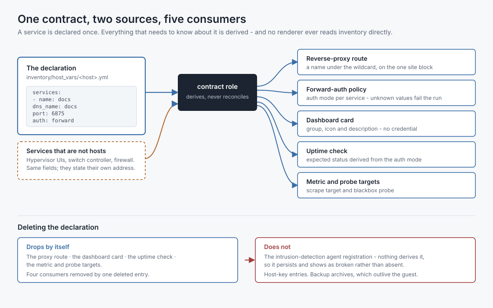
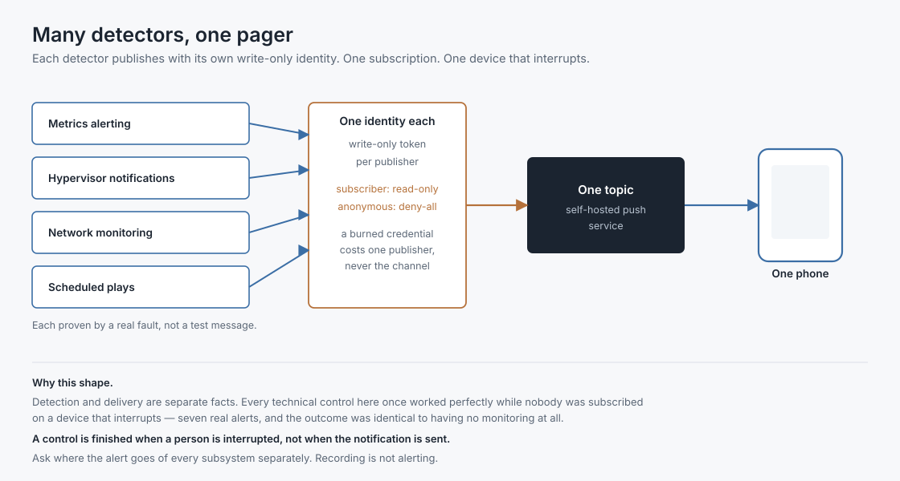

# jeffnet-homelab

Documentation of my home network and homelab — the architecture, the patterns I reuse, and what
reviewing all of it turned up.

It covers the whole environment rather than one rack: a segmented network behind a firewall doing
all inter-VLAN policy, a three-node Proxmox cluster built with Terraform and Ansible, the
self-hosted services on top of it, home automation and cameras, and the smaller builds that don't
belong to any of those.

The findings are the point. The build took weeks; going back through it service by service has
produced more than the build did, and almost all of it in what things leave behind rather than in
the things themselves.

> **Scope note.** This is documentation, not the estate. The infrastructure code lives in a private
> repository; nothing here is generated from it and nothing here is applied to anything. Internal
> names, addresses and identifiers are substituted throughout — see [SETUP.md](SETUP.md).

---

## Where to start

| If you want | Read |
|---|---|
| The home side — IoT, cameras, automation | [docs/home/](docs/home/README.md) |
| How a service gets deployed, and reviewed | [docs/operations/](docs/operations/reviewing-a-service.md) |
| **The interesting part** | [docs/findings/](docs/findings/) |
| The rules that came out of it | [docs/principles/](docs/principles/README.md) |
| Code you can lift | [examples/](examples/) |

---

## The environment in one page

**Network** — six VLANs behind a firewall that is both gateway and the only inter-VLAN policy
point, with a managed switch carrying tagged trunks. The segmentation write-up is being redone
against an export of the live ruleset rather than against my notes; see
[the findings index](docs/findings/) when it lands.

**Platform** — three Proxmox nodes in a cluster, every guest declared in Terraform, configuration by
Ansible from a dedicated controller. Two plays run estate-wide on a schedule. Guests are containers
except where the workload forbids it.

**Ingress** — one reverse proxy, one site block, one wildcard certificate over DNS-01, one
split-horizon wildcard DNS record. A service is declared once and *derived* into its proxy route,
dashboard card, uptime check and metric targets. Adding one is an entry, never a block; deleting one
removes all four by itself.

**Observability** — probes at three layers, network monitoring by SNMP, config backup by SSH, log
aggregation, and host-based intrusion detection on every guest. Detectors publish to a single push
service with one write-only identity each, and one phone subscription.

**Credentials** — three roles, three scopes, no overlap. The workstation authors. The controller
executes with a read-only clone and holds the vault. The scheduler executes on a timer with a
read-only deploy key, the vault delivered out of band, and SSH pinned by source address.

**Home** — automation and cameras on isolated VLANs, documented as a design rather than as a floor
plan. See [the scoping note](docs/home/README.md) for what is deliberately absent.

---

## How a service is declared

## How an alert reaches a person

---

## The thesis

Most of what fails in a small estate does not look broken.

A backup storage that had never carried a byte was *fully declared*. A mail notification path was
*trying the whole time*, bouncing to an address nobody read. A monitoring stack fired seven real
alerts into a channel nobody was subscribed to on a device that interrupts. A delivery task copied
nothing, twice, from two different wrong paths, and reported success both times. A guard compared a
list against an empty one produced by a pipeline whose last command could not fail. An enrolment
port was closed on purpose, correctly, and nothing recorded that the estate had stopped being able
to grow.

Exactly one of those looks like an outage. The rest look like green.

Everything in [docs/principles](docs/principles/README.md) is there because one of them happened
here, on real hardware, and was found by reading the machine instead of the documentation.

---

## Licence

Documentation under CC BY 4.0. Code in `examples/` under the MIT Licence. See [LICENSE](LICENSE).
